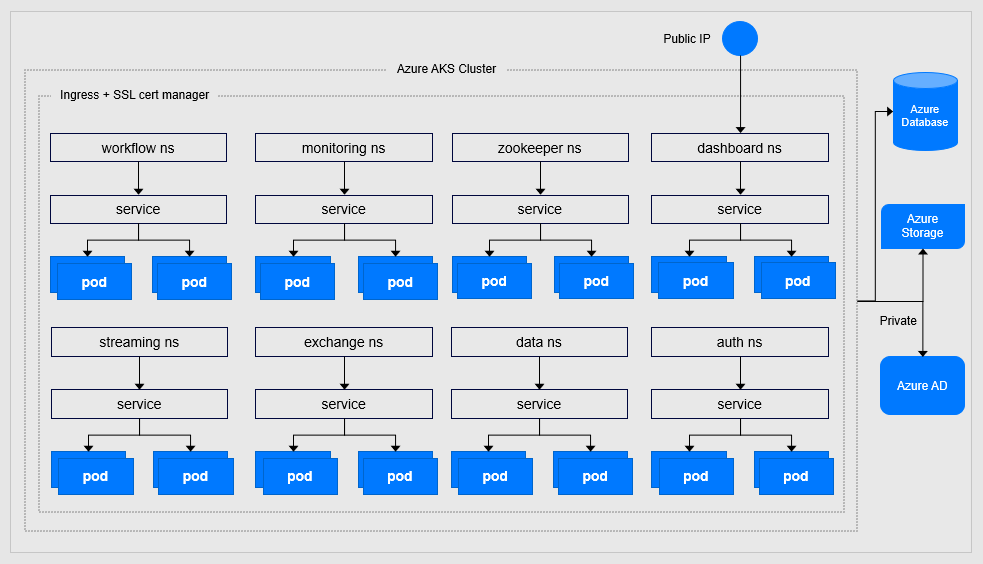

# Retell Platform
## Azure Deployment
### Requirements
- Azure Kubernetes Service (AKS)
- Azure Database
- Azure Storage
- Azure AD
- Kubernetes
- Docker 

### Azure AKS Setup
Azure AKS environment diagram

### Azure Cluster Recommendation
- Kubernetes version: 1.19.6
- Operating system: Linux
- Node count: 3
- Node size: Standard_E8as_V4

## Connector Development
There are two types of connectors: Sources and Destination. A connector takes the form of a Docker image. Best way to develop a connector is by using the Connector Development Kit (CDK).

### Python Connector Development Kit (CDK)
#### Requirements
- Python >= 3.7
- Docker
- NodeJS
#### Basic Concepts
The specification requires a Source connector to support 4 distinct operations:
1. Spec: configuration in order to interact with the underlying technical system, database
2. Check: validate the provided configuration is valid with sufficient permissions
3. Discover: discover the Source's schema. This lets users select what a subset of the data to sync
4. Read: perform the actual syncing process

#### Checklist

- Step 1. Create the Source: using a code generator which bootstrap the scaffolding for a new connector
- Step 2. Install Dependencies: initial python environment
- Step 3. Define Inputs: declares the inputs it needs to read data from the underlying data source. This can be done by creating a .json file.
- Step 4. Connection Checking: verifies that the input configuration 
- Step 5. Declare the Schema
- Step 6. Read Data: contains built-in functions or helpers for authentication, pagination, handling rate limiting or transient errors
- Step 7. Build Connector: using docker image
- Step 8. Test Connector
